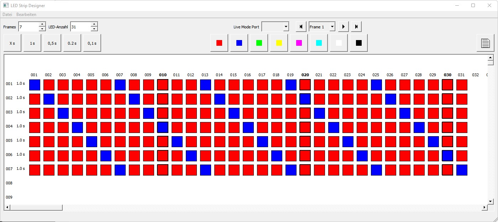

# LEDStripDesigner

A software to design a LED Strip with animations for an AVR Arduino ATMega328P. The animation is saved on a SD-Card or send by UART to the microprocessor.

## System Design

A software for windows was designed to setup a LED Srip with WS1228B LEDs. Each frame of an animation is created and a frame time can be set. The animation can be testet via a serial port (baud: 115200).  After finishing the setup an animation can be exportet to a "video" file. This file is read from the SD Card by the ATMega32P (Arduino). The playback is played in a endless loop. The AVR processor plays allways the first file with the "ALC" extention in the file allocation table.

## UART (Live mode)

The windows software will send live data to a serial port. This is for testing the animation and for setup challenging animations. For the transmission a baudrate of 115200 is used. The data is send without any checksum. Each frame that is send starts with a character 0x02. This character will indicate that a new frame is transmitted. For debugging the processor sends readable data. This can be shown in a log window in the windows application.

## Hardware

TBD

## Screenshots

